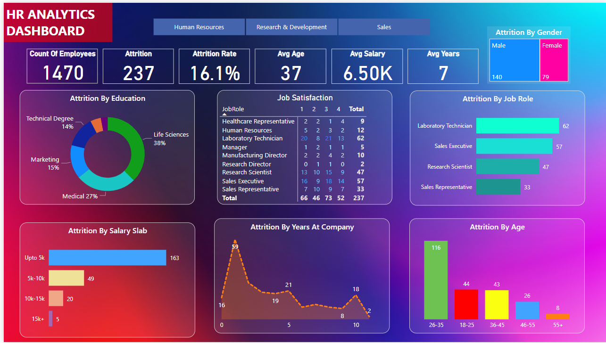

# Attrition Rate Analysis Project

## Overview
This project aims to analyze and visualize employee attrition rates using Power BI, providing insights into trends and factors that contribute to employee turnover.

## Features
- Interactive Power BI dashboard for attrition rate analysis.
- Predictive analytics to forecast potential attrition risks.
- Drill-down capabilities for detailed data exploration.

## Visualizations

## Usage
The dashboard can be used by HR departments to understand and mitigate factors leading to employee attrition.

## Contributions
Contributions are welcome. Please fork the repository and submit a pull request.

## License
This project is licensed under the MIT License - see the LICENSE.md file for details.
